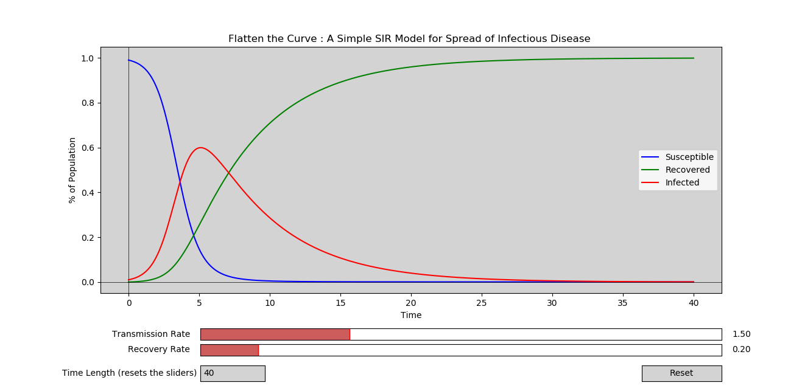
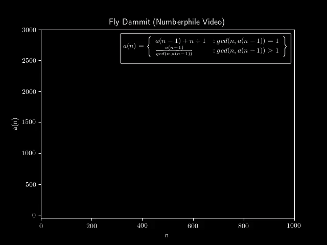
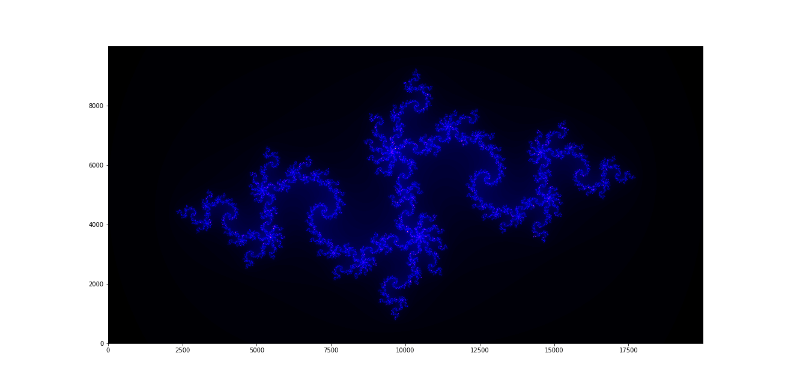
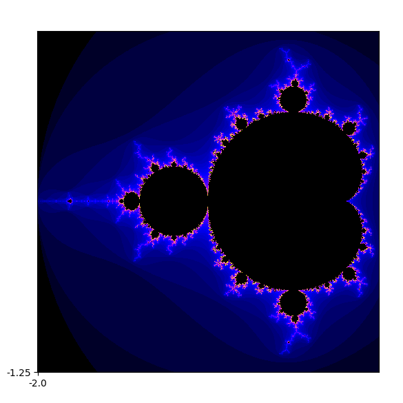

# Mathinations
## The animations
### Flatten The Curve
This is a interactive plot, modelling the spread of an infectious disease. This simple model is called SIR (Susceptible, Recovered, Infected) and uses a simple system of ordinary differential equations.

We can see that by reducing the Transmission Rate, we can flatten the curve of infected persons, and hopefully make it pass under the Susceptible curve, meaning that some people are not going to be infected at all.

  

### Fly Dammit
This graph was featured on a numberphile video and inspired me to animate it with python.

  

## The Graphs/Plots
### The Julia Set

  

  

###The Mandelbrot Set

  

